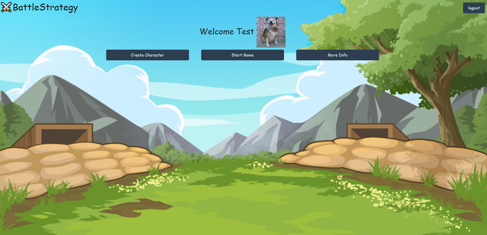
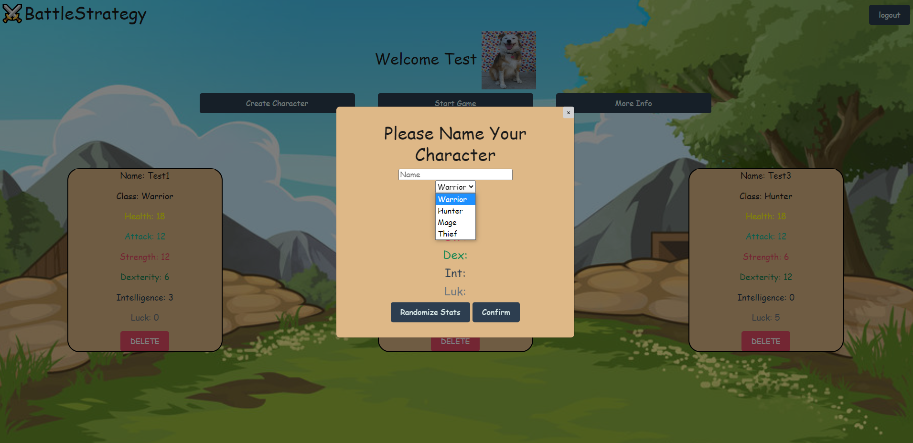
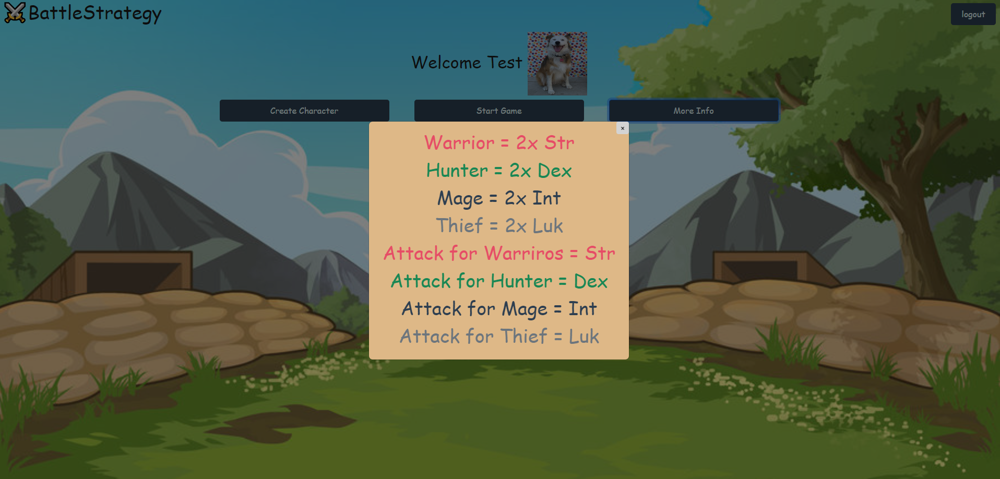
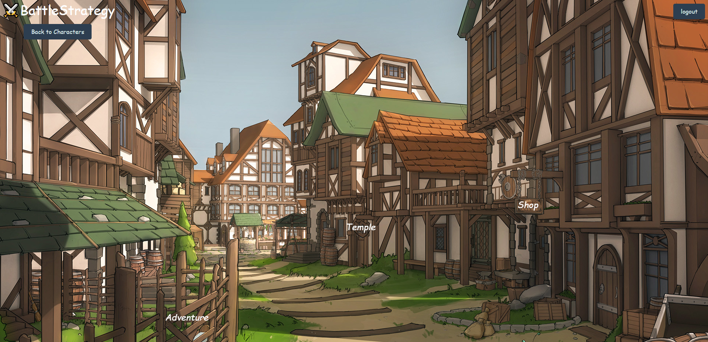
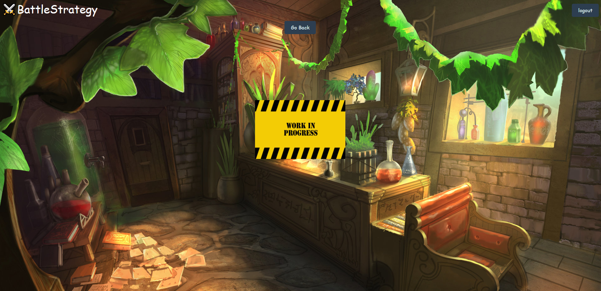
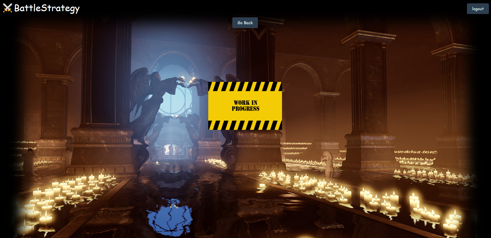
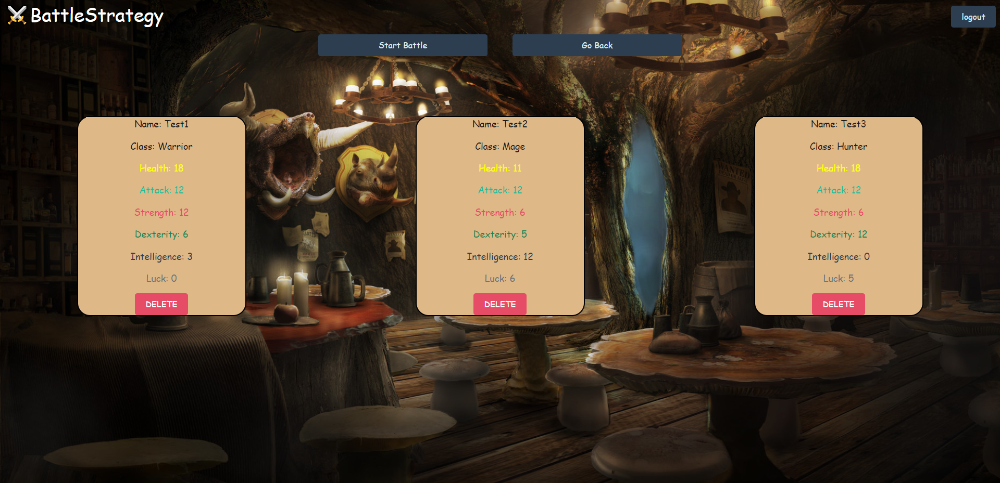
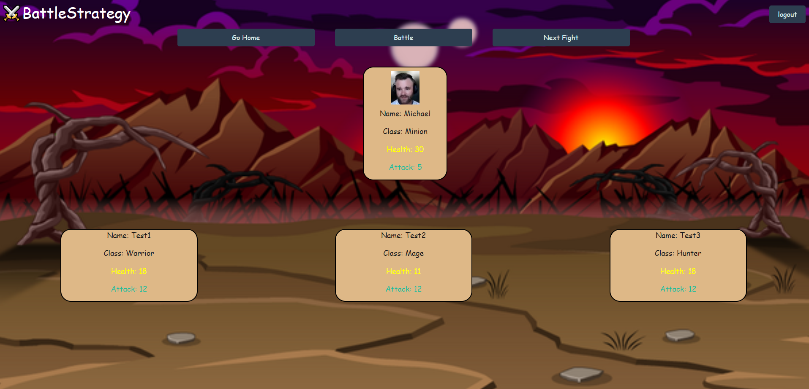

# ⚔️BattleStrategy

## Table of Content
- [Description](#description)
- [Installation](#installation)

## Description

BattleStrategy is web game that allows users to create characters that they use to fight monsters and bosses with. This game is rated E for everyone should definitely give it and try. BattleStrategy first makes the user signup and from there they are able to create their first character to fight monsters with. You are only able to use 4 characters at a given time so make sure you carefully choose what class you want! When you create a character, each character will be given a random assortment of stats that you can randomize until you have a stats that you are happy with! 

## Installation

To test the game yourself, you first have to clone the repository. You then type npm i into your terminal to make sure you have downloaded all the neccessary dependencies. After that you also have to create the database in a sql workbench. Now you are finally ready to start the game! You type npm start and once you type in localhost:3001 in your browser you will be taken to our login page.

After signing up and deciding if you would like a profile picture, you are then taken to the character creation page.

Below is an example of what creating a character looks like.

If you would like more info about the classes and how certain stats are calculated you can click the more info button. Below is an image of what that looks like.

After you finish creating all the characters you like (remember you can only use 4 at a time) you can now click the start game and you are taken to the home page below. Here you have many options but there are three main buttons to progress in the game. Adventure, Shop, and Temple.

Here is an image of what our shop page and temple page looks like. Unfortunately adding functionality and game design incorporating these two locations are currently wishlist items that will be worked on in the future.

If you click the adventure button you are taken to this pre battle screen that redisplays the characters you have made and gives you option to either start battle or go back.

Once you start battle you are taken to the first battle which is right below.

After beating the first level you may proceed to the second battle.

After beating the second level you are now at the last level. 

Hopefully you can beat the boss and win the game! Good Luck!

